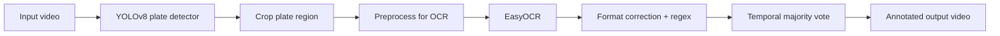
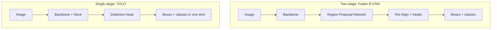
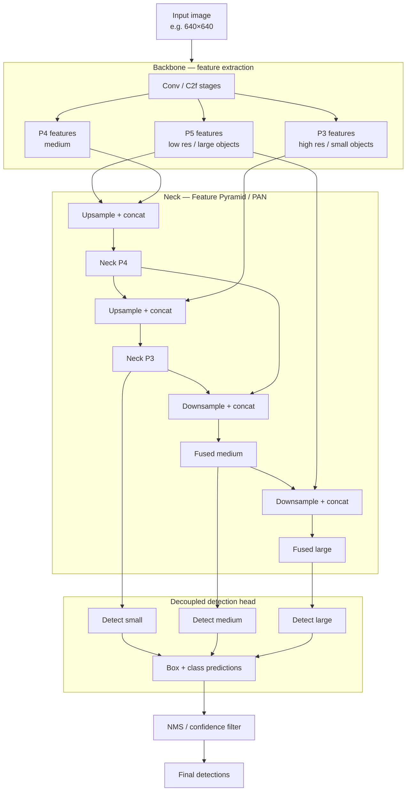
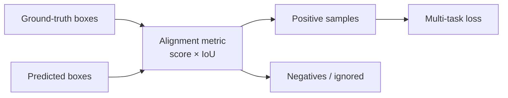
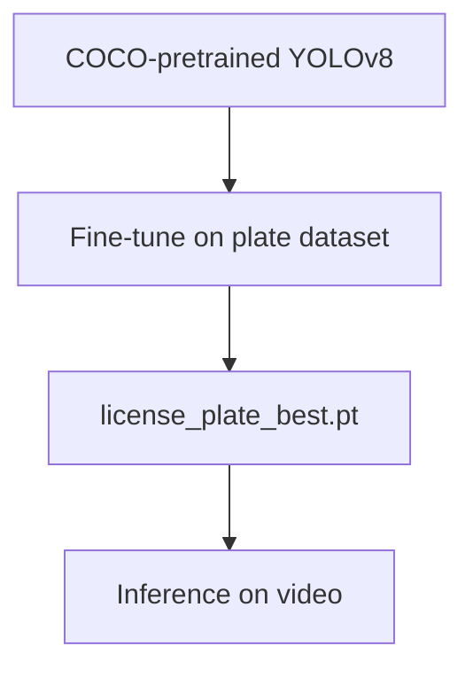
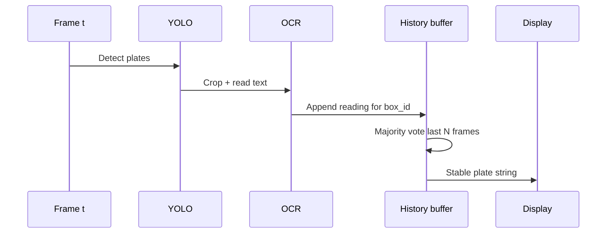

# YOLO Project 1 — License Plate Detection & OCR

End-to-end **license plate recognition** pipeline: a fine-tuned **YOLOv8** detector finds plates in video, then **EasyOCR** reads the text. Post-processing corrects common OCR mistakes and stabilizes readings across frames.

## Project files

| File | Description |
|------|-------------|
| `easyocryolo.py` | Main inference script (YOLO + EasyOCR on video) |
| `YOLO_+_OCR_for_license_plate_detection.ipynb` | Notebook version of the same pipeline |
| `license_plate_best.pt` | Fine-tuned YOLOv8 weights for plate detection |
| `license_plate_detection_input.mp4` | Sample input video |
| `output/output_with_license.avi` | Annotated output (generated; gitignored) |

## Run

From the repo root (with your virtual environment activated):

```powershell
pip install ultralytics easyocr opencv-python torch
python "YOLO Project 1/easyocryolo.py"
```

Press **q** to quit early (if a live preview window is available). Output is saved to:

```text
YOLO Project 1/output/output_with_license.avi
```

Open with **VLC** or **Movies & TV** if the default player has issues.

---

## What this project does



1. **Detect** license plates with a fine-tuned YOLOv8 model (`license_plate_best.pt`)
2. **Crop** each plate region from the frame
3. **Preprocess** (grayscale → Otsu threshold → 2× upscale)
4. **Read text** with EasyOCR (alphanumeric allowlist)
5. **Correct** common letter/digit confusions for a UK-style plate format (`AB12CDE`)
6. **Stabilize** readings with a per-box majority vote over recent frames
7. **Draw** boxes, zoomed plate overlays, and recognized text; save the video

---

## YOLO: the big idea

**YOLO (You Only Look Once)** is a family of **single-stage** object detectors. Unlike two-stage detectors (R-CNN → Faster R-CNN), YOLO predicts bounding boxes **and** class scores in **one forward pass** over the image.

| Approach | How it works | Trade-off |
|----------|--------------|-----------|
| **Two-stage** (Faster R-CNN) | Propose regions → classify/refine each region | Accurate, slower |
| **Single-stage** (YOLO) | Dense predictions over a grid / feature maps | Fast, strong real-time accuracy |



YOLO treats detection as a **regression** problem: divide the image into cells / use anchors or anchor-free predictions, and directly regress box coordinates plus objectness and class probabilities.

### YOLO evolution (brief)

| Version | Year | Notable idea |
|---------|------|--------------|
| YOLOv1 | 2016 | Single-shot detection; grid cells predict boxes |
| YOLOv2 / YOLO9000 | 2016–17 | Anchors, multi-scale training, WordTree |
| YOLOv3 | 2018 | Multi-scale predictions (FPN-like), Darknet-53 |
| YOLOv4 / v5 | 2020 | Bag of freebies/specials; practical training tricks |
| YOLOv6 / v7 | 2022 | Industrial / real-time focus |
| **YOLOv8** | 2023 | Ultralytics; anchor-free, C2f blocks, strong defaults |
| YOLOv9–v11… | 2024+ | Further efficiency / accuracy iterations |

This project uses **YOLOv8** via the Ultralytics API.

---

## YOLOv8 architecture (detailed)

YOLOv8 keeps the classic **backbone → neck → head** layout, but is **anchor-free** and uses modern CSP-style blocks.



### 1. Backbone

- Stack of **Conv** layers and **C2f** (CSP bottleneck with more skip connections than older C3)
- Extracts hierarchical features: shallow maps keep fine detail; deep maps hold semantics
- Pretrained on large datasets (e.g. COCO) when using `yolov8n.pt`, then fine-tuned for plates

### 2. Neck (FPN + PAN style)

- **Top-down** path: upsample deep features and fuse with shallower maps (helps small objects)
- **Bottom-up** path: push localization cues back to deeper levels
- Multi-scale fusion is why YOLO handles small license plates and larger ones in the same frame

### 3. Head (decoupled, anchor-free)

YOLOv8 predicts:

| Output | Meaning |
|--------|---------|
| **Box** | Distance from each grid point to left/top/right/bottom (or center + size) — **no predefined anchors** |
| **Class** | Softmax / sigmoid class scores (here: essentially “license plate”) |
| **Objectness** | Often folded into the classification / task-aligned assignment |

**Anchor-free** means the model does not match predictions to hand-crafted anchor boxes of fixed aspect ratios. That reduces hyperparameters and often improves generalization.

### 4. Model size variants

| Variant | Role in practice |
|---------|------------------|
| `yolov8n` | Nano — fastest, least accurate |
| `yolov8s` | Small |
| `yolov8m` | Medium |
| `yolov8l` | Large |
| `yolov8x` | Extra large — slowest, most accurate |

This project uses a **fine-tuned** checkpoint (`license_plate_best.pt`), typically derived from a nano/small base for speed on video.

---

## Loss, assignment, and training (YOLOv8)

### Task-aligned label assignment

During training, YOLOv8 does **not** simply assign “closest anchor.” It uses **Task-Aligned Assigner**-style matching: positives are selected where **classification score × IoU** (alignment metric) is high. That pairs boxes that are both confident **and** well localized.



### Loss components

YOLOv8’s total loss is a **weighted sum of three terms**:

```text
Total loss L = λ_box · L_box + λ_cls · L_cls + λ_dfl · L_dfl
```

Where each `λ` (lambda) is a weight that balances how much that term matters during training.

| Loss term | What it optimizes | Typical form |
|-----------|-------------------|--------------|
| **L_box** | Box localization (where is the object?) | **CIoU** (Complete IoU) — overlap + center distance + aspect ratio |
| **L_cls** | Class prediction (what is the object?) | Binary cross-entropy / Varifocal-style classification loss |
| **L_dfl** | Box edge precision (how sharp are the borders?) | **Distribution Focal Loss** — models each box edge as a soft distribution over distance bins (more precise than regressing a single number) |

**CIoU** improves on plain IoU by also penalizing:

1. Distance between predicted and true box **centers**
2. Mismatched **aspect ratios** (width/height)

That matters a lot for thin, wide objects like license plates.

**DFL (Distribution Focal Loss)** lets the model express uncertainty about exact edges — useful when plate borders are blurry or low-resolution.

### Optimization & training tricks

| Aspect | Typical YOLOv8 practice |
|--------|-------------------------|
| **Optimizer** | SGD or AdamW (Ultralytics defaults often use SGD with momentum / AdamW depending on config) |
| **LR schedule** | Warmup + cosine / linear decay |
| **Augmentation** | Mosaic, mixup, random affine, HSV jitter, horizontal flip |
| **Input size** | Commonly 640×640 (multiples of 32) |
| **EMA** | Exponential moving average of weights for more stable checkpoints |
| **AMP** | Automatic mixed precision on GPU for speed |
| **Early stopping** | Stop when validation mAP plateaus |

### Fine-tuning for this project

Conceptually:



1. Start from a pretrained detector (learned generic edges, textures, cars)
2. Fine-tune on labeled **license plate** images/videos (boxes around plates)
3. Save the best validation checkpoint → `license_plate_best.pt`
4. Run inference with a confidence threshold (this script uses `0.3`)

Inference then applies **NMS** (non-maximum suppression) so overlapping duplicate boxes collapse to one.

---

## YOLO vs R-CNN family (context from Lecture 3)

| | R-CNN family | YOLO |
|--|--------------|------|
| Stages | Two (propose → refine) | One |
| Speed | Slower | Real-time friendly |
| Proposals | Selective Search / RPN | Dense / anchor-free grid |
| Best for | Accuracy-first / research | Video, cameras, production |

Lecture 2 introduced Ultralytics YOLO for general detection; **this project** applies a **domain-specific** fine-tuned YOLO + OCR.

---

## This project’s pipeline (code walkthrough)

### Detection

```python
model = YOLO("license_plate_best.pt")
results = model(frame, verbose=False)
```

For each box above `CONF_THRESH` (0.3), crop `frame[y1:y2, x1:x2]`.

### OCR preprocessing

```text
BGR crop → grayscale → Otsu binary threshold → 2× cubic resize → EasyOCR
```

Otsu separates plate characters from background without a hand-tuned threshold. Upscaling helps OCR on small plates.

### Format correction (UK-style `LLNNLLL`)

Positions 0–1 and 4–6 must be **letters**; positions 2–3 must be **digits**. Common OCR swaps are remapped, e.g.:

| Confused as | Corrected to (context) |
|-------------|------------------------|
| `0` in a letter slot | `O` |
| `O` in a digit slot | `0` |
| `1` ↔ `I`, `5` ↔ `S`, `8` ↔ `B`, `Z` ↔ `2` | depending on position |

A regex `^[A-Z]{2}[0-9]{2}[A-Z]{3}$` rejects anything that still doesn’t match.

### Temporal stabilization



`get_box_id` buckets box coordinates so nearby detections share a history deque (length 10). The **most frequent** valid reading is shown — reducing flicker when OCR is noisy for a few frames.

### Visualization & save

- Green rectangle around the plate  
- Zoomed plate overlay above the box  
- Stabilized text with black outline + white fill  
- Written with **MJPG / AVI** for reliable Windows playback  

---

## Key concepts

- Single-stage vs two-stage detection  
- YOLOv8 backbone / neck / decoupled head  
- Anchor-free prediction and multi-scale features  
- CIoU + classification + Distribution Focal Loss  
- Fine-tuning pretrained weights for a custom class (plates)  
- Confidence threshold + NMS  
- OCR pipeline: preprocess → EasyOCR → format rules → temporal voting  

## Output

| Artifact | Path |
|----------|------|
| Annotated video | `output/output_with_license.avi` |

Generated videos and large weight files (`*.pt`) are gitignored. Keep `license_plate_best.pt` locally in this folder to run inference.

## Further reading

- [Ultralytics YOLOv8 docs](https://docs.ultralytics.com/models/yolov8/)  
- [YOLOv8 paper / technical report (Ultralytics)](https://github.com/ultralytics/ultralytics)  
- [EasyOCR](https://github.com/JaidedAI/EasyOCR)  
- Lecture 2 README — general YOLO usage in this bootcamp  
- Lecture 3 README — R-CNN family for comparison with two-stage detectors  
